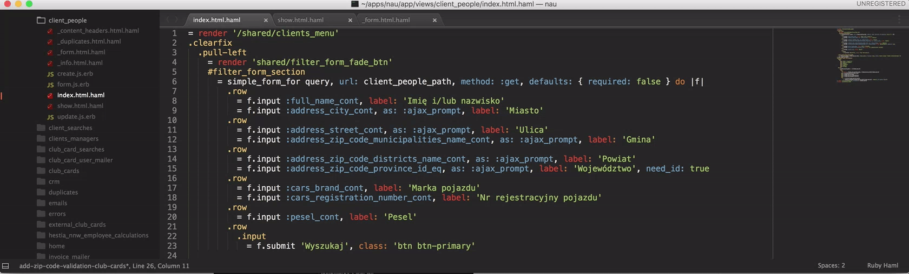

# Rails JavaScript View Name
  Some usefull stuff when working with java script views in Rails Views.
## Copy expected javascript view name


## Navigate through views


## Create new view


## Create custom view


## Installation
Clone repository in sublime packages directory

```CTRL + SHIFT + P -> Preferences Browse Packages```

```git clone git@github.com:epicatization/rails_javascript_view_name.git```


